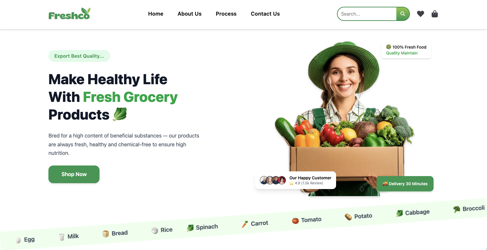

# 🛒 Freshco –  Grocery Website

Freshco is a modern and responsive **fresh grocery shopping website** built using **React and Tailwind CSS**.  
The website provides a smooth shopping experience with a clean UI, fast performance, product categories, brand showcases and sliders.


---

## 📸 Website Screenshot



---

## 🔗 Live Demo

👉 https://freshcogrocery.netlify.app/

---

## ✨ Features
- Fully responsive clean UI
- Category-based grocery browsing
- Add to cart & wishlist styled buttons
- Smooth scrolling brand strip
- Product slider / carousel
- Attractive discount banner
- Customer reviews section
- Fast loading & optimized assets

---

## 🛠 Tech Stack

| Technology | Purpose |
|----------|--------|
| React JS | Frontend UI |
| Tailwind CSS | Styling |
| React Router DOM | Navigation / Multiple pages |
| Lucide React | Premium icons |
| React Fast Marquee | Auto-scrolling label strip |
| React Multi Carousel | Product sliders |

---

## 📦 Dependencies & Purpose

| Package | Work / Purpose |
|--------|----------------|
| **react** | Builds the UI using components |
| **react-dom** | Renders React UI inside the browser |
| **react-router-dom** | Handles routing & navigation |
| **tailwindcss** | Fast modern styling using utility classes |
| **@tailwindcss/vite** | Enables Tailwind + Vite integration |
| **react-icons** | Provides multiple icon collections |
| **lucide-react** | Lightweight premium icons |
| **react-fast-marquee** | Auto-moving scrolling text & brand strip |
| **react-multi-carousel** | Product slider / carousel component |

---

## ⚙️ Installation & Setup

```bash
# Clone the repository
git clone https://github.com/your-username/freshco.git

# Navigate into project
cd freshco

# Install dependencies
npm install

# Start development server
npm run dev
```


## 📁 Folder Structure
```
Freshco
│
├── node_modules/
├── public/
│
└── src/
    ├── assets/
    │
    ├── components/
    │   ├── Card/
    │   ├── Categories/
    │   ├── Discount/
    │   ├── Footer/
    │   ├── Hero/
    │   ├── Home/
    │   ├── Navbar/
    │   ├── Our Process/
    │   ├── ProductList/
    │   ├── Products/
    │   ├── Testimonials/
    │   └── Values/
    │
    ├── GroceryMarquee.jsx
    ├── App.jsx
    ├── App.css
    ├── index.css
    └── main.jsx
│
├── .gitignore
├── eslint.config.js
├── index.html
├── package.json
├── package-lock.json
├── README.md
└── vite.config.js

```

## 🚀 Deployment

You can deploy this project on:

👉 Vercel	⭐ Best for React apps

👉 Netlify	⭐ Fast & free

👉 GitHub Pages	⚠ Requires SPA routing config

## 👨‍💻 Author

### Ashish Kumar Gautam

**GitHub**  — https://github.com/akgautam8662

**Email**  — ashishgautam8662@gmail.com

**LinkedIn**  — www.linkedin.com/in/akgautam8662

**Portfolio** — https://ashishgautam8662.netlify.app/
